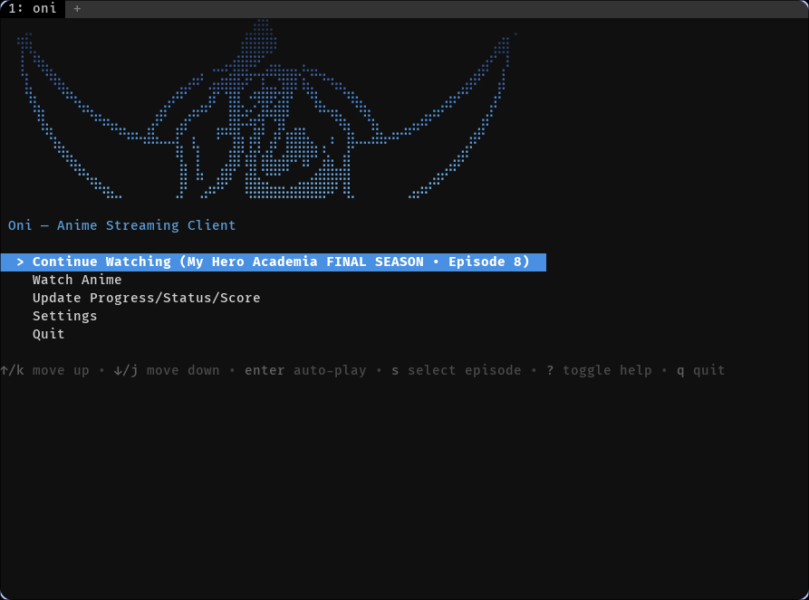
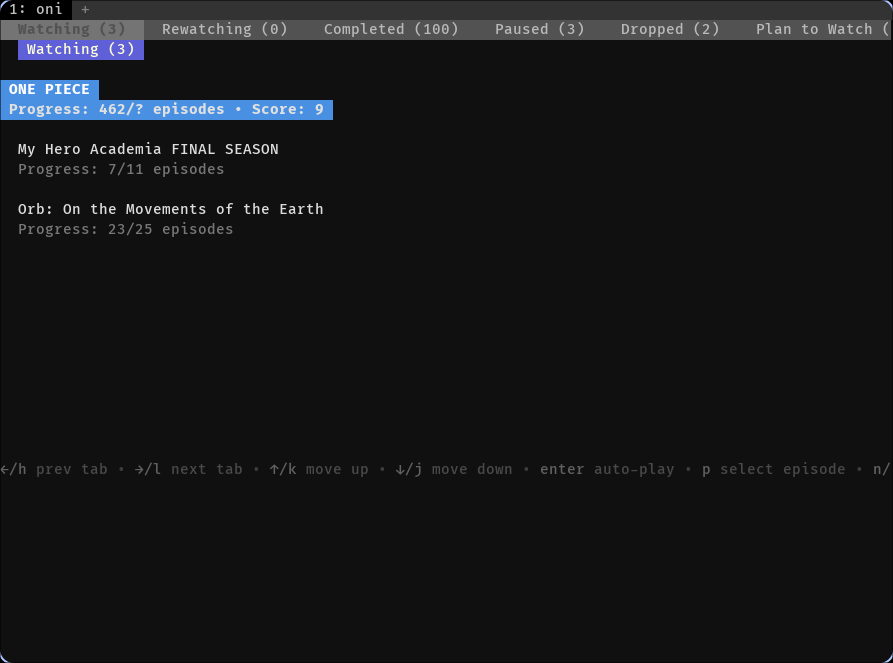
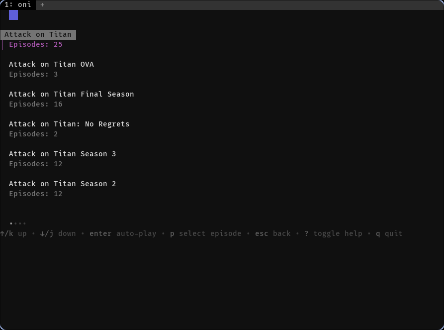
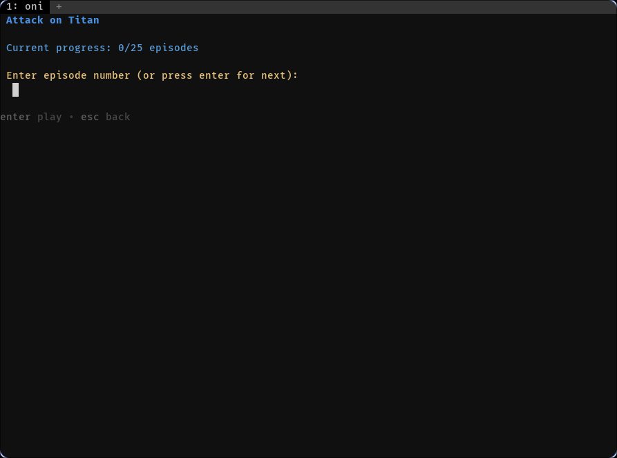

```
   ⣀⠀⠀⠀⠀⠀⠀⠀⠀⠀⠀⠀⠀⠀⠀⠀⠀⠀⠀⠀⠀⠀⠀⠀⠀⠀⠀⣀⣾⣿⡄⠀⠀⠀⠀⠀⠀⠀⠀⠀⠀⠀⠀⠀⠀⠀⠀⠀⠀⠀⠀⠀⠀⠀⠀⠀⠀⠀⠀⠀⡀
  ⢻⢷⡀⠀⠀⠀⠀⠀⠀⠀⠀⠀⠀⠀⠀⠀⠀⠀⠀⠀⠀⠀⠀⠀⠀⠀⠀⢰⣿⣿⣿⡿⠀⠀⠀⠀⠀⠀⠀⠀⠀⠀⠀⠀⠀⠀⠀⠀⠀⠀⠀⠀⠀⠀⠀⠀⠀⠀⢠⣾⡇
  ⢸⠀⠻⣦⡀⠀⠀⠀⠀⠀⠀⠀⠀⠀⠀⠀⠀⠀⠀⠀⠀⠀⠀⠀⣀⣠⢴⣿⡿⠟⢁⣤⣄⣀⡀⣄⣀⠀⠀⠀⠀⠀⠀⠀⠀⠀⠀⠀⠀⠀⠀⠀⠀⠀⠀⠀⢀⣴⠋⢀⠇
  ⠈⣇⠀⠈⠻⣦⡀⠀⠀⠀⠀⠀⠀⠀⠀⠀⠀⠀⠀⠀⣀⡴⠞⢀⣤⣶⣿⣯⠟⠉⣏⣉⢻⣿⡏⣦⡉⠙⠲⣤⡀⠀⠀⠀⠀⠀⠀⠀⠀⠀⠀⠀⠀⠀⢀⣴⠟⠁⠀⣼⠀
  ⠀⠹⣆⠀⠀⠈⠛⢦⣀⠀⠀⠀⠀⠀⠀⠀⠀⠀⣠⠞⠋⠀⢀⣰⠏⠈⣿⣇⠐⡻⣿⢟⣽⡟⠀⠈⢻⣄⠀⠀⠙⢷⣄⠀⠀⠀⠀⠀⠀⠀⠀⠀⣠⡶⠋⠁⠀⠀⣰⠃⠀
  ⠀⠀⠹⣇⠀⠀⠀⠀⠉⠳⢦⣄⡀⠀⠀⠀⢀⡾⠃⠀⣠⠞⠋⠁⠀⠀⣿⣗⣫⡴⡟⠻⣿⠃⠀⠀⠀⠉⠙⢷⣄⠀⠙⢧⡀⠀⠀⠀⢀⣠⡶⠛⠁⠀⠀⠀⠀⣴⠃⠀⠀
  ⠀⠀⠀⠙⢧⡀⠀⠀⠀⠀⠀⠈⠙⠳⠶⢤⣿⣄⣀⣸⠋⢠⠀⠀⠸⠛⢻⣧⢠⣿⠃⣰⠏⣶⣿⣧⡀⠀⢠⠀⢹⣆⣀⣨⣷⡤⠶⠚⠋⠁⠀⠀⠀⠀⠀⢠⡾⠃⠀⠀⠀
  ⠀⠀⠀⠀⠈⠻⣦⡀⠀⠀⠀⠀⠀⠀⠀⠀⠀⠀⠀⠸⡇⠈⡇⠀⠀⠀⣾⡟⣼⡞⣴⣏⣠⣿⡿⣿⠿⢘⣄⠀⣼⠁⠀⠀⠀⠀⠀⠀⠀⠀⠀⠀⠀⢀⣴⠏⠀⠀⠀⠀⠀
  ⠀⠀⠀⠀⠀⠀⠈⠻⢦⣀⠀⠀⠀⠀⠀⠀⠀⠀⠀⠀⣿⠀⣧⠀⢀⣾⡟⠁⣽⣇⠻⠿⠟⠃⠀⠉⣠⣾⣿⣶⣿⠀⠀⠀⠀⠀⠀⠀⠀⠀⠀⣠⡴⠛⠁⠀⠀⠀⠀⠀⠀
  ⠀⠀⠀⠀⠀⠀⠀⠀⠀⠙⠳⣦⣀⠀⠀⠀⠀⠀⠀⢀⡟⠀⢀⡴⠞⠋⠀⠀⢿⣿⣿⣶⣶⣴⣾⣿⣿⣿⠿⠃⢿⡀⠀⠀⠀⠀⠀⠀⣠⡴⠞⠉⠀⠀⠀⠀⠀⠀⠀⠀⠀
```

<h1>oni</h1>

<p>minimal, customizable, and beautiful anime streaming CLI inspired by <a href="https://github.com/justchokingaround/jerry">jerry</a>, written in Go</p>

<br>

---

## motivation

oni is a modern rewrite of [jerry](https://github.com/justchokingaround/jerry) in Go with a beautiful TUI powered by Bubble Tea.

i built this because i love the concept of a terminal-based anime streaming client. the simplicity of _jerry_ instantly clicked with me, yet i felt it lacked some things that could level up the experience — this is just my attempt at trying to make the ux as smooth as possible and adding features i thought it needed.

## features

- beautiful terminal UI - interactive menus powered by Bubble Tea and Lipgloss
- multiple providers - support for allanime, aniwatch, yugen, hdrezka, and aniworld
- anilist integration - sync your watch progress, scores, and status with AniList
- discord presence - show what you're watching on Discord (optional)
- multiple players - support for mpv, vlc, and iina
- watch history - resume from where you left off automatically
- smart caching - cached lists load instantly on subsequent visits
- tab-based interface - navigate between anime categories with arrow keys
- easy configuration - INI-based config with built-in editor
- incognito mode - watch anime without updating AniList progress

## installation

### via `go install`

```bash
go install github.com/pranshuj73/oni@latest
```

### build from source

```bash
# clone the repository
git clone https://github.com/pranshuj73/oni.git
cd oni

# build the application
go build

# move to a directory in your PATH
sudo mv oni /usr/local/bin/
```

## configuration

`oni` stores its configuration file at `~/.oni/config.ini`. you can edit it directly or use the built-in editor:

```bash
oni -e
```

### configuration options

- `player`: video player to use (`mpv`, `vlc`, or `iina`). defaults to `mpv`.
- `player_arguments`: additional arguments to pass to the player.
- `provider`: anime provider (`allanime`, `aniwatch`, `yugen`, `hdrezka`, or `aniworld`). defaults to `allanime`.
- `quality`: video quality (e.g., `1080`, `720`, `480`). defaults to `1080`.
- `sub_or_dub`: audio type (`sub` or `dub`). defaults to `sub`.
- `subs_language`: subtitle language. defaults to `english`.
- `no_anilist`: disable AniList integration (`true` or `false`).
- `score_on_completion`: automatically prompt for score when episode completes (`true` or `false`).
- `discord_presence`: enable Discord Rich Presence (`true` or `false`).
- `show_adult_content`: show adult content in search results (`true` or `false`).

### example config

#### default configuration

```ini
[player]
player = mpv
player_arguments = 

[provider]
provider = allanime
download_dir = 
quality = 1080

[anilist]
no_anilist = false
score_on_completion = false

[ui]
use_external_menu = false
image_preview = false
json_output = false

[playback]
sub_or_dub = sub
subs_language = english

[discord]
discord_presence = false

[advanced]
show_adult_content = false
```

## usage

```bash
# basic usage - start interactive TUI
oni

# edit configuration
oni -e

# enable Discord presence
oni -d

# set video quality
oni -q 720

# use a specific provider
oni -w aniwatch

# set audio type (sub or dub)
oni --sub-or-dub dub

# show version
oni -v

# show help
oni -h
```

## keyboard navigation

### main menu
- `↑/↓` or `j/k` - navigate
- `Enter` - select
- `i` - toggle incognito mode
- `q` - quit

### anime list (tab-based)
- `←/→` or `h/l` - switch between tabs (categories)
- `↑/↓` or `j/k` - navigate within list (auto-scrolls)
- `Enter` - select anime
- `r` - manually refresh list
- `Esc` - return to main menu

### search/list
- `↑/↓` or `j/k` - navigate
- `Enter` - select
- `Backspace` - go back
- `Esc` - return to main menu

### config editor
- `↑/↓` or `j/k` - navigate
- `Enter` - edit value
- `s` - save configuration
- `Esc` - return to main menu

## anilist setup

1. run `oni` for the first time
2. you'll be prompted to visit: `https://anilist.co/api/v2/oauth/authorize?client_id=32038&response_type=token`
3. copy the access token and paste it into the terminal
4. your token will be saved at `~/.local/share/jerry/anilist_token.txt`

## display examples

|        |     |
|----------------------------------|-----------------------------------------|
|  |  |

## providers

### allanime (default)
- fast and reliable
- good quality streams
- extensive library

### aniwatch
- high-quality streams
- multiple subtitle options
- good for popular anime

### yugen
- alternative source
- decent quality
- good uptime

### hdrezka
- russian-focused provider
- multiple quality options
- full decryption support implemented

### aniworld
- german provider
- good selection
- M3U8 streams

## acknowledgements

- [jerry](https://github.com/justchokingaround/jerry) for the original idea and inspiration
- [Bubble Tea](https://github.com/charmbracelet/bubbletea) for the TUI framework
- [Lipgloss](https://github.com/charmbracelet/lipgloss) for styling
- [rich-go](https://github.com/hugolgst/rich-go) for Discord integration
- [AniList](https://anilist.co/) for the anime tracking API

## contributing

contributions are always welcome! if you have ideas, bug reports, or want to submit code, please feel free to open an issue or a pull request.

## contributors

<a href="https://github.com/pranshuj73/oni/graphs/contributors">

  

</a>

<br><br>

<div align="center">

  <a href="https://github.com/pranshuj73/oni/blob/main/LICENSE"></a>&nbsp;&nbsp;

</div>
